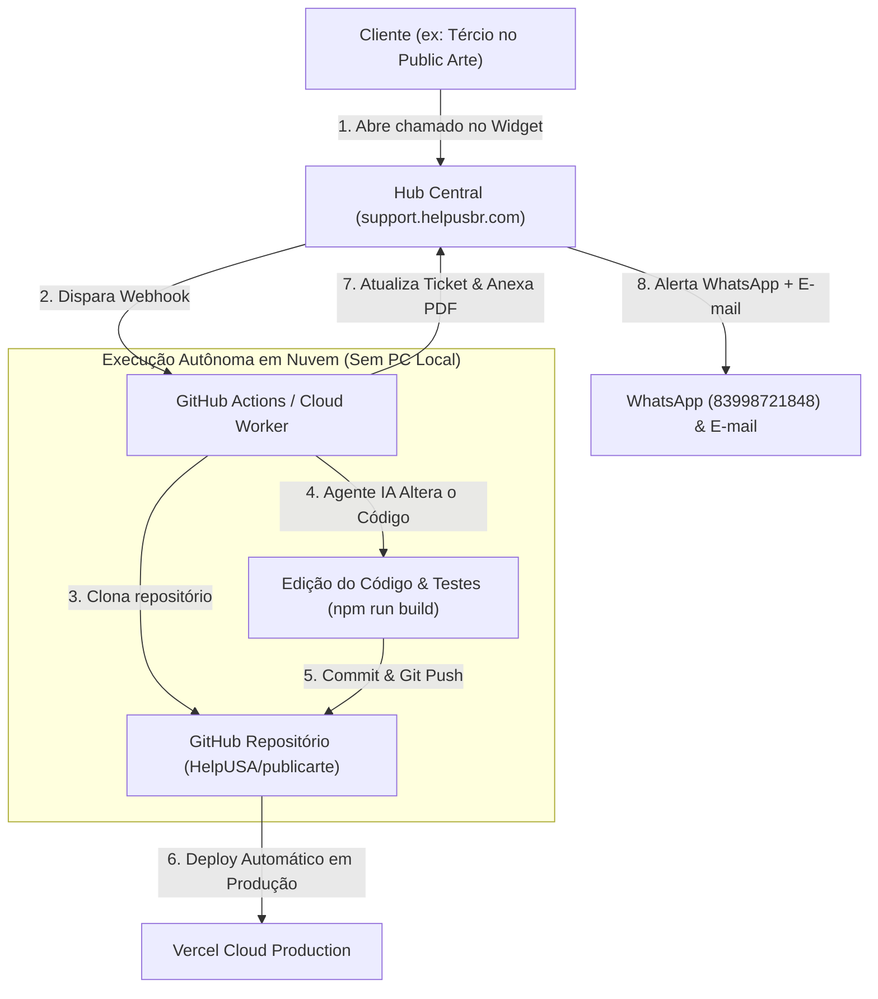

# 🤖 Arquitetura do Agente Autônomo de Desenvolvimento em Nuvem 24/7

 Este documento explica como funciona a execução autônoma de alterações de código-fonte reais em projetos do ecossistema HelpUS sem depender do computador local estar ligado.

---

## 🏗️ Fluxo de Execução 100% na Nuvem (GitHub Actions + Cloud AI Agent)

---

## 🛠️ Como os Dois Modos de Execução Funcionam:

### 1. Modo Local (Pair Programming no seu Computador)
- **Quando usar**: Durante o horário de trabalho com o computador ligado.
- **Como funciona**: Eu (Antigravity AI Agent) leio a lista de solicitações em `support.helpusbr.com`, abro as pastas locais em `d:\AntiG\`, escrevo o código, testo, faço o build e publico no Vercel.

### 2. Modo Cloud Autônomo 24/7 (GitHub Actions + Cloud AI Engine)
- **Quando usar**: Fora do horário de expediente ou quando o seu computador estiver desligado.
- **Como funciona**: 
  - O chamado criado dispara um **Webhook do Vercel/Supabase** para o **GitHub Actions** da organização `HelpUSA`.
  - A Runner do GitHub aciona a API do modelo de linguagem (Gemini/OpenAI) com permissão de edição do repositório.
  - A IA altera os arquivos diretamente no branch de produção do repositório, valida o `npm run build`, realiza o `git push` para o GitHub e aciona o Vercel para subir a alteração para o ar automaticamente.
  - O ticket é atualizado para `RESOLVED` com o Relatório Técnico em PDF.

---

[[index|⬅️ Voltar ao Índice do Vault]]
