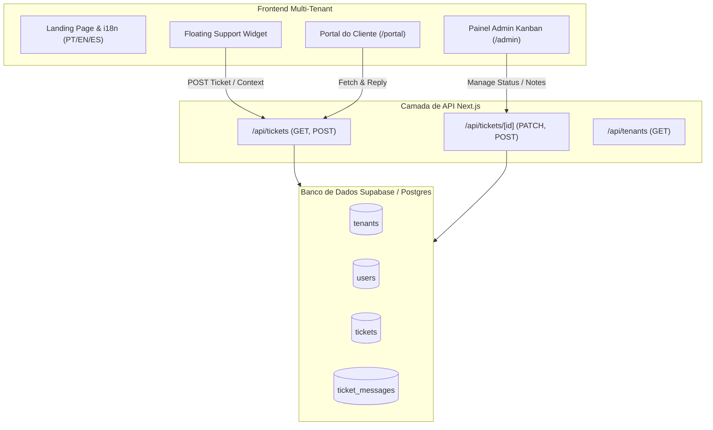

# 🏗️ SDS — Arquitetura Multi-Tenant (`support.helpusbr.com`)

Este documento especifica a arquitetura da plataforma **HelpUS Support Hub**, cobrindo o modelo de dados, isolamento multi-tenant, ciclo de vida dos tickets no Kanban e controle de acesso.

---

## 1. Visão de Componentes

---

## 2. Eschema do Banco de Dados (Supabase PostgreSQL)

### Tabela `tenants`
| Coluna | Tipo | Descrição |
| :--- | :--- | :--- |
| `id` | `text` (PK) | Slug do cliente (ex: `publicarte`, `tatica`) |
| `name` | `text` | Nome exibido do cliente |
| `domain` | `text` | Domínio do cliente |
| `api_key` | `text` | Chave de integração do widget |
| `created_at` | `timestamptz` | Data de cadastro |

### Tabela `tickets`
| Coluna | Tipo | Descrição |
| :--- | :--- | :--- |
| `id` | `uuid` (PK) | ID único do ticket |
| `tenant_id` | `text` (FK) | Vínculo com a tabela `tenants` |
| `code` | `text` | Código do chamado (ex: `PUB-101`) |
| `title` | `text` | Assunto do chamado |
| `description` | `text` | Detalhamento |
| `category` | `text` | `bug`, `feature`, `question`, `support` |
| `priority` | `text` | `low`, `medium`, `high`, `urgent` |
| `status` | `text` | `new`, `in_progress`, `waiting_client`, `in_testing`, `resolved` |
| `created_by_email`| `text` | E-mail do solicitante |
| `created_by_name` | `text` | Nome do solicitante |
| `context_data` | `jsonb` | URL da página, SO, navegador |

---

## 3. Isolamento Multi-Tenant & RLS (Row Level Security)

1. **Injeção de Header**: Todas as requisições enviadas pelo Widget embutido contêm o header `X-Tenant-Id: publicarte`.
2. **Escopo Automático**: As consultas SQL filtram estritamente por `tenant_id`, impedindo vazamento de dados entre empresas distintas.

---

## 4. Notas Internas vs Respostas Públicas

* **Respostas Públicas (`is_internal_note: false`)**: Visíveis no Portal do Cliente e na interface do Widget.
* **Notas Internas (`is_internal_note: true`)**: Visíveis exclusivamente para atendentes da HelpUS (ex: Eduardo) dentro do Painel Admin.

---

[[index|⬅️ Voltar ao Índice do Vault]]
